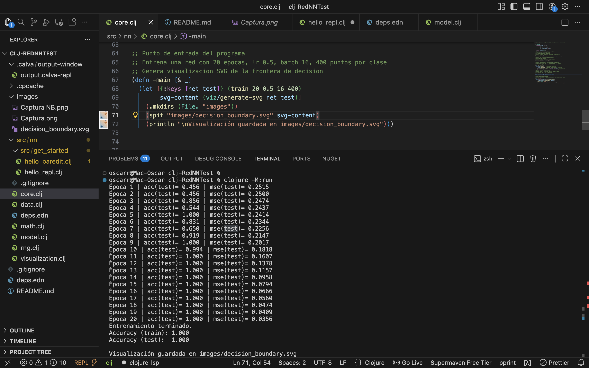
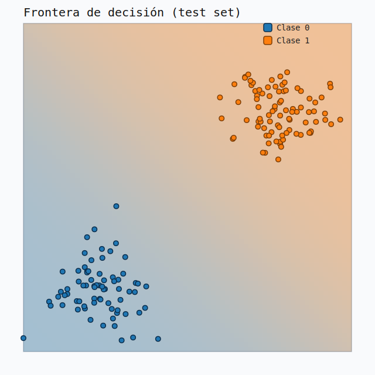

# clj-RedNNTest – Red neuronal en Clojure desde cero

clj-RedNNTest es un proyecto de práctica para aprender Clojure construyendo una red neuronal completamente desde cero.  
El objetivo no es solo tener un modelo que funcione, sino usar cada archivo y cada función como pretexto para entender mejor:

- La sintaxis y el estilo funcional de Clojure.
- Cómo se implementa una red neuronal feedforward básica.
- Cómo conectar todo en un flujo reproducible de datos, entrenamiento y visualización.

El proyecto se apoya conceptualmente en la serie de videos de 3Blue1Brown sobre redes neuronales y en un cuaderno de estudio en NotebookLM, donde se organizaron las notas sobre Clojure y sobre el diseño de la red.

---

## Motivación y objetivos

La idea central de este repositorio es aprender Clojure a través de un ejemplo concreto y completo:

1. Usar una red neuronal sencilla para tener un hilo conductor claro.
2. Implementar todo a mano: generación de datos, operaciones matemáticas, entrenamiento y visualización.
3. Mantener el código lo suficientemente simple como para poder leerlo casi línea por línea y razonar sobre lo que pasa en cada etapa.

El resultado es un proyecto pequeño, pero con el ciclo completo:

- Datos sintéticos.
- Modelo 2 → 8 → 2.
- Entrenamiento con mini-batches.
- Métricas de evaluación.
- Visualización de la frontera de decisión.

---

## Referencias de estudio

Durante el desarrollo del proyecto se utilizaron dos apoyos principales:

1. **Serie de videos de 3Blue1Brown sobre redes neuronales**  
   Se tomó como referencia la forma en que explica:
   - La interpretación geométrica de los pesos.
   - El papel de las funciones de activación.
   - La idea de ajustar parámetros mediante gradientes.

2. **Cuaderno en NotebookLM: “Clojure Fundamentals, Tools, NN”**  
   En este cuaderno se recopilaron:
   - Conceptos básicos de Clojure (colecciones, funciones, namespaces).
   - Notas sobre herramientas: Clojure CLI, deps.edn, uso de REPL.
   - Apuntes sobre cómo organizar el código de la red en módulos.

Espacio para captura del cuaderno:

```md
<p align="center">
  
</p>
```

---

## Arquitectura general del proyecto

Estructura principal de archivos:

```text
clj-RedNNTest/
├─ deps.edn
├─ src/
│  └─ nn/
│     ├─ core.clj           ; Punto de entrada y ciclo de entrenamiento
│     ├─ data.clj           ; Generación y normalización de datos sintéticos
│     ├─ math.clj           ; Operaciones matemáticas y funciones de activación
│     ├─ model.clj          ; Definición de la red y backpropagation
│     ├─ visualization.clj  ; Generación de la frontera de decisión en SVG
│     └─ rng.clj            ; Generador de números aleatorios reproducible
└─ images/
   └─ decision_boundary.svg ; Fichero generado con la frontera de decisión
```

Cada archivo tiene una responsabilidad clara:

- `data.clj` define cómo se generan y preparan los datos.
- `math.clj` concentra las funciones matemáticas de bajo nivel.
- `model.clj` describe la red neuronal y el algoritmo de entrenamiento.
- `core.clj` orquesta todo el flujo: datos → modelo → métricas → visualización.
- `visualization.clj` crea una imagen SVG de la frontera de decisión.
- `rng.clj` asegura que los resultados sean reproducibles mediante una semilla fija.

---

## Descripción técnica del modelo

### 1. Arquitectura de la red (nn.core / nn.model)

- Tipo de red: feedforward para clasificación binaria.
- Arquitectura: **2 → 8 → 2**
  - 2 entradas.
  - 8 neuronas en la capa oculta.
  - 2 neuronas de salida (one-hot para las dos clases).
- Función de activación: sigmoide en ambas capas.
- Inicialización de pesos: valores aleatorios en el rango [-0.5, 0.5].

Parámetros por defecto del entrenamiento:

- Épocas: 20
- Learning rate: 0.5
- Batch size: 16
- Puntos por clase: 400

### 2. Algoritmo de entrenamiento (nn.model)

- Método de optimización: mini-batch Stochastic Gradient Descent.
- Backpropagation implementado de forma explícita:
  - Cálculo manual de gradientes para cada capa.
  - Acumulación de gradientes por mini-batch.
- Función de pérdida: Mean Squared Error (MSE).
- División del dataset:
  - 80 % para entrenamiento.
  - 20 % para prueba.
- Métricas:
  - Exactitud (accuracy) en el conjunto de prueba.
  - MSE en el conjunto de prueba.

### 3. Operaciones matemáticas (nn.math)

Incluye:

- Producto punto.
- Suma y resta de vectores.
- Multiplicación escalar.
- Función sigmoide y su derivada.
- Función ReLU y su derivada (preparadas para futuras extensiones).
- Utilidades para aplicar funciones elemento a elemento sobre vectores.

### 4. Generación de datos sintéticos (nn.data)

- Generación de dos clusters con distribución aproximadamente normal.
- Uso de un método tipo Box-Muller para obtener puntos gaussianos.
- Normalización de las coordenadas al rango [0, 1] mediante min-max scaling.
- Etiquetas codificadas en one-hot para las dos clases.

### 5. Visualización de la frontera de decisión (nn.visualization)

- Salida en formato SVG.
- Tamaño aproximado: 640 x 640 píxeles.
- Se construye una cuadrícula de puntos en el plano de entrada.
- Para cada punto del grid se evalúa la red y se colorea en función de la probabilidad.
- Paleta de colores:
  - Azul para la clase 0.
  - Naranja para la clase 1.
- Se dibujan:
  - Los puntos del dataset.
  - La frontera de decisión implícita en los cambios de color.
  - Una pequeña leyenda.

Espacio para la imagen generada por el modelo:

```md
<p align="center">
  
</p>

<p align="center">
  
</p>
```

### 6. Reproducibilidad (nn.rng)

- Semilla fija: `1337`.
- Funciones auxiliares para:
  - Generar números en [0, 1).
  - Generar pesos iniciales en [-0.5, 0.5].
- Al mantener la misma semilla es posible repetir los experimentos y obtener los mismos resultados.

---

## Flujo de ejecución

El flujo lógico del programa es el siguiente:

1. Generación de datos  
   Se crean dos grupos de puntos en el plano, cada uno asociado a una clase distinta.

2. Normalización y preparación  
   - Se lleva cada característica al rango [0, 1].  
   - Se construyen las etiquetas en formato one-hot.

3. División entrenamiento / prueba  
   - 80 % de los datos para entrenar.
   - 20 % para evaluar.

4. Inicialización de la red  
   Se construye la arquitectura 2 → 8 → 2 con pesos aleatorios.

5. Entrenamiento  
   - Se recorren los datos durante 20 épocas.
   - En cada época se procesan mini-batches de tamaño 16.
   - Se calculan y aplican los gradientes mediante backpropagation.

6. Evaluación  
   En cada época se reportan:
   - Exactitud en el conjunto de prueba.
   - MSE en el conjunto de prueba.

7. Visualización  
   Al finalizar el entrenamiento se genera el archivo `images/decision_boundary.svg` con la frontera de decisión.

---

## Cómo ejecutar el proyecto

### Requisitos

- Java instalado (JDK reciente).
- Clojure CLI (`clj`) instalado.

### Comando principal

Desde la carpeta raíz del proyecto:

```bash
clj -M:run
```

Este comando:

1. Genera los datos.
2. Entrena la red durante 20 épocas.
3. Muestra en la terminal las métricas por época.
4. Crea el archivo `images/decision_boundary.svg`.

Si el alias `:run` no estuviera disponible en `deps.edn`, se puede ejecutar también con:

```bash
clj -M -m nn.core
```

---

## Uso desde REPL

Para experimentar de forma interactiva:

1. Iniciar un REPL en la raíz del proyecto:

   ```bash
   clj
   ```

2. Cargar el namespace principal:

   ```clojure
   (require '[nn.core :as nn])
   ```

3. Entrenar el modelo manualmente:

   ```clojure
   (def model (nn/train 20 0.5 16 400))
   ```

4. Extender el experimento modificando parámetros, trazando nuevas fronteras o cambiando la arquitectura.

---

## Resultados esperados

Con la configuración por defecto, el problema es razonablemente separable y se espera:

- Exactitud en el conjunto de prueba por encima de 0.95.
- MSE en el conjunto de prueba por debajo de 0.05 al final del entrenamiento.
- Una frontera de decisión suave que separa claramente los dos clusters en el SVG generado.

---

## Guía de lectura del código

Una forma recomendada de estudiar el proyecto es la siguiente:

1. `rng.clj`  
   Ver cómo se define la semilla y se generan números aleatorios reproducibles.

2. `data.clj`  
   Revisar cómo se construyen los puntos de cada clase y cómo se normalizan.

3. `math.clj`  
   Entender las primitivas matemáticas utilizadas por el modelo: operaciones vectoriales, sigmoide, derivadas.

4. `model.clj`  
   Estudiar cómo se representa la red, cómo se ejecuta el forward pass y cómo se calculan los gradientes para backpropagation.

5. `core.clj`  
   Ver el ciclo completo de entrenamiento, las llamadas a las métricas y la integración con la visualización.

6. `visualization.clj`  
   Analizar cómo se convierte la salida del modelo en una imagen SVG de la frontera de decisión.

---

## Posibles extensiones

Algunas ideas para seguir experimentando con el proyecto:

- Añadir más funciones de activación (tanh, leaky ReLU).
- Hacer que la arquitectura sea configurable desde parámetros externos.
- Probar con otros tipos de datasets (XOR, espirales, medias móviles de series de tiempo).
- Incorporar regularización (L2, dropout).
- Guardar y cargar pesos entrenados para comparar distintas corridas.
- Extender las métricas con matrices de confusión y medidas como F1.

Este repositorio está pensado para ser un laboratorio pequeño, donde se puedan probar cambios en el modelo y observar directamente su efecto en el entrenamiento y en la frontera de decisión.
